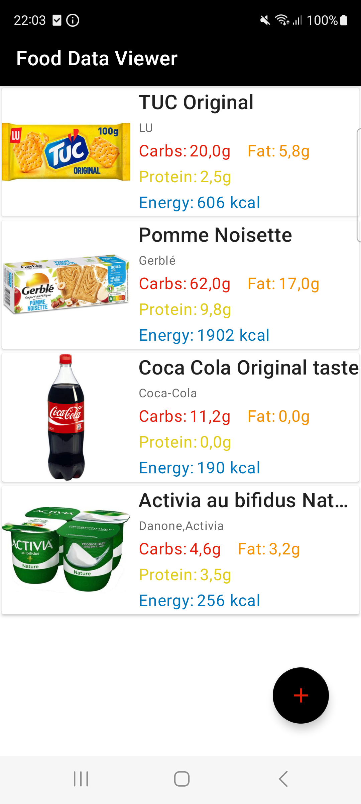

# Food Data Viewer

This is Udemy [Android Redux/MVI pattern. Tests. Dependency Injection.](https://www.udemy.com/course/android-mvi-pattern-tests-dependency-injection/)  training.

## Getting Started

Download the project from [Github](https://github.com/Maniak-pl/FoodDataViewer), the updated branch is **master**

### Dependencies

This project uses the following dependencies

- [ConstraintLayout](https://developer.android.com/training/constraint-layout)
- [Retrofit](https://square.github.io/retrofit/)
- [Moshi](https://github.com/square/moshi)
- [Mobius](https://github.com/spotify/mobius)
- [Dagger](https://developer.android.com/training/dependency-injection/dagger-android)
- [RxJava](https://github.com/ReactiveX/RxJava)
- [RxAndroid](https://github.com/ReactiveX/RxAndroid)
- [Glide](https://github.com/bumptech/glide)
- [Room](https://developer.android.com/training/data-storage/room)
- [Junit4](https://github.com/junit-team/junit4)
- [Espresso](https://developer.android.com/training/testing/espresso)

## Screenshots

 